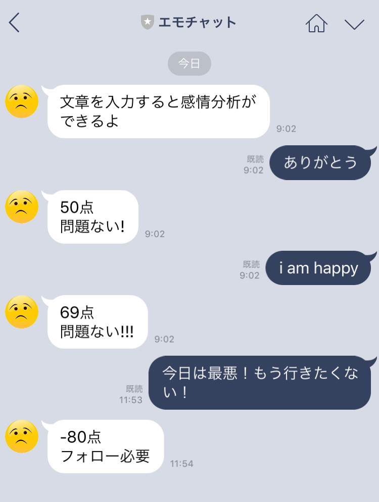

# EmoLINE
Japanese Emotion Analysis on LINE in Japanese

LINEのチャット上で文章を打つと感情分析ができます．

LINEの文章を打つと -100 〜 +100 点の間でその文章の怒り度が判定されます． -100に近ければ近いほど不機嫌であり，+100に近いほど上機嫌です． 友人や恋人の文章を転送することで，相手の機嫌がわかるというアプリケーションです．

下のQRコードを読み取って，文章を入力したり，他の文章を転送(コピペ)してみてください．

 

